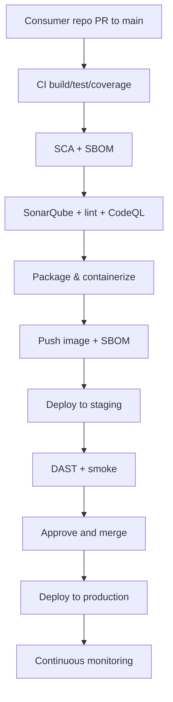
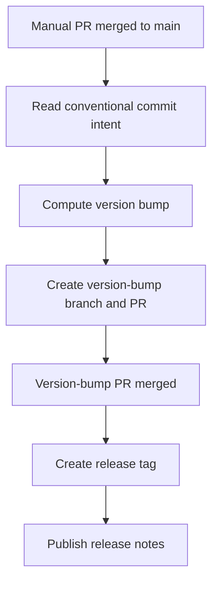
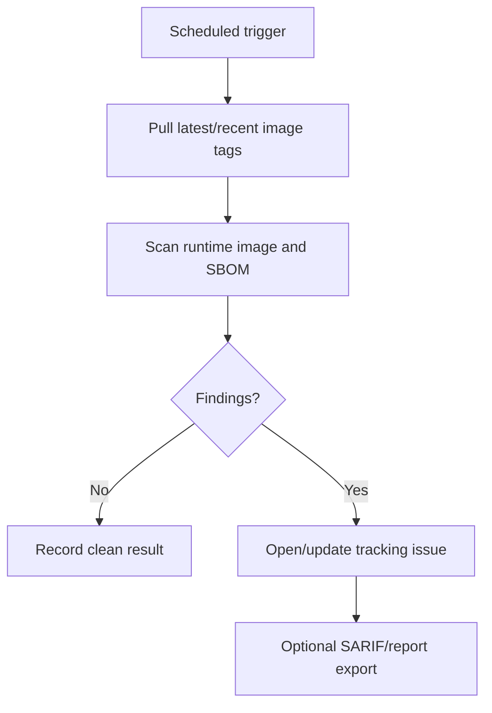

# CI/CD Template Dependency Map

## Main delivery chain

## Release automation chain

## Periodic image scan chain

## Dependency rules
- CI gates must pass before container publish.
- Container publish must complete before staging deploy.
- Staging deploy must complete before DAST/smoke.
- DAST/smoke must pass before production deploy.
- Version bump PR merge must happen before release tag creation.
- Release tag must exist before release notes publication.
- Periodic image scans depend on pushed images and SBOM artifacts.
- Monitoring depends on deployed production image and stable health endpoints.

## Cross-cutting dependencies
- SonarQube requires code checkout, build output, and token access.
- SCA/SBOM requires dependency restore or container metadata.
- DAST requires a reachable staging URL and test credentials if protected.
- Registry push requires registry credentials and image naming rules.
- Production deploy requires environment approval and protected secrets.
